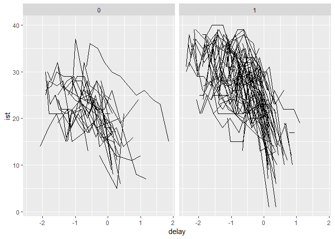
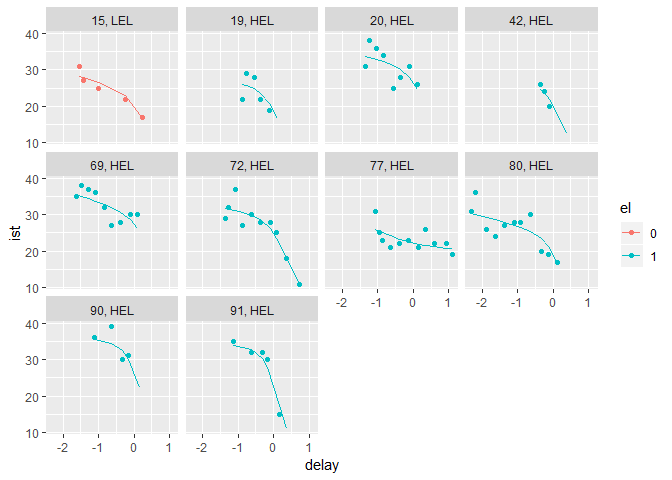

Introduction
------------

This R package proposes different functions to make inference on a
random changepoint framework for longitudinal data. The work is still in
progress and the package is not yet fully functional. Already
implemented or being implemented are : 
* testRCPMM: a test for the
existence of a random changepoint for longitudinal data 
* rcpme: an estimation algorithm for random changepoint mixed models 
* bircpme: an estimation algorithm for bivariate random changepoint mixed models
taking into account an eventual correlation between two markers

In the following, we will see how to use these functions and how to
manipulate them with a toy dataset.

The dataset: PAQUID cohort
--------------------------

A brief description of the data

    paquid <- read.table("paquid.csv", header = TRUE, sep = ",")
    head(paquid)

    ##    X id ist      delay el
    ## 1 16  1  25 -1.9700001  1
    ## 2 17  1  25 -1.8621301  1
    ## 3 18  1  28 -1.6521401  1
    ## 4 19  1  23 -1.1809501  1
    ## 5 20  1  16 -0.1474333  1
    ## 6 21  1  15  0.1474333  1

    library(ggplot2); library(rcpm);library(splines2);library(nlme);library(marqLevAlg);

    ## Warning: package 'splines2' was built under R version 3.5.2

    ggplot(data = paquid, aes(x = delay, y = ist, group = id)) + geom_path() + facet_grid(. ~ el)

    ## Warning: Removed 62 rows containing missing values (geom_path).

Testing the existence of the random changepoint
-----------------------------------------------

    test <- testRCPMM(longdata = paquid, formu = ist ~ delay | id, covariate = "NULL", gamma = 0.1, nbnodes = 5, nbpert = 500)
    test

    ## $`p-value`
    ## [1] 0
    ## 
    ## $pertus
    ##   [1] -3.183338e+00 -1.525077e+00 -3.494778e+00 -7.689744e-01 -2.187318e+00
    ##   [6] -3.059498e-01 -7.936764e+00 -1.108738e+00 -1.158945e+01 -1.535607e+00
    ##  [11] -1.326137e+00 -7.726203e-01 -5.683039e+00 -7.555079e-02 -9.343721e-01
    ##  [16] -4.905721e-01 -5.556524e-01 -1.692781e+00 -9.712637e-01 -8.812574e-01
    ##  [21] -3.425493e+00 -1.664510e+00 -4.448931e-01 -4.598456e+00 -5.188245e+00
    ##  [26] -1.753078e+00 -1.690002e+00 -1.685582e+00 -1.945623e+00 -6.796456e+00
    ##  [31] -3.235710e-01 -1.976180e+00 -2.028133e+00 -7.912927e-01 -9.574723e+00
    ##  [36] -3.580824e+00 -1.710786e+00 -1.503927e+00 -1.951553e+00 -2.224475e-01
    ##  [41] -1.697608e+00 -2.845412e+00 -2.636967e+00 -1.140490e+00 -9.302540e-01
    ##  [46] -2.405005e+00 -5.869314e+00 -3.182919e+00 -3.438435e+00 -2.281297e+00
    ##  [51] -2.848138e+00 -9.018770e-01 -2.992375e+00 -2.640194e+00 -4.013773e+00
    ##  [56] -1.058862e+00 -1.534919e+00 -2.041547e+00 -3.097085e+00 -8.516929e-01
    ##  [61] -1.317719e-01 -2.204970e-01 -5.312408e+00 -6.164035e-01 -4.758756e-01
    ##  [66] -3.391262e+00 -1.295867e+00 -4.548384e+00 -1.642769e+00 -6.887915e-01
    ##  [71] -3.047045e-01 -9.192073e-01 -4.179130e+00 -3.495971e+00 -6.623560e+00
    ##  [76] -2.706064e+00 -5.706323e+00 -2.987819e-01 -3.514800e+00 -4.351714e-01
    ##  [81] -2.104640e+00 -5.451852e+00 -4.329582e+00 -1.348548e+00 -2.318282e-01
    ##  [86] -2.793884e+00 -4.769819e+00 -1.821214e+00 -3.679219e+00 -1.532534e+00
    ##  [91] -7.509993e+00 -2.943546e+00 -4.430663e-01 -4.249156e-01 -1.576558e+00
    ##  [96] -5.214904e+00 -1.226210e+01 -1.782066e+00 -8.940197e-01 -4.473851e-01
    ## [101] -2.713515e+00 -2.732076e+00 -2.546697e+00 -8.433946e-01 -1.059683e+00
    ## [106] -1.069200e+00 -5.823184e-01 -3.394547e+00 -3.226027e+00 -2.369295e+00
    ## [111] -4.512758e+00 -9.258463e+00 -1.985108e-01 -4.674863e+00 -9.297077e-01
    ## [116] -8.122981e-01 -1.717972e+00 -1.808858e+00 -1.627912e+00 -5.579693e+00
    ## [121] -3.118346e-01 -1.173160e+00 -2.110767e-01 -3.422526e+00 -3.128706e+00
    ## [126] -4.411396e+00 -3.812548e-01 -2.005415e+00 -1.363041e+00 -1.125773e+00
    ## [131] -1.528407e+00 -3.665934e+00 -5.291893e-01 -1.492093e+00 -5.586888e-08
    ## [136] -7.456445e-01 -3.832444e-01 -5.707608e-01 -1.474638e+00 -3.057895e+00
    ## [141] -2.002989e+00 -2.869341e+00 -1.036018e+00 -3.392228e+00 -2.141055e+00
    ## [146] -9.421468e+00 -9.360746e-01 -2.287408e+00 -2.020596e+00 -5.031189e+00
    ## [151] -5.969025e+00 -4.466575e+00 -7.296542e+00 -3.306236e+00 -2.532424e-01
    ## [156] -7.603257e-02 -1.714233e+00 -2.998393e+00 -8.774843e-01 -1.609333e+00
    ## [161] -6.175518e-01 -9.533009e+00 -1.264323e+00 -1.122622e+00 -5.938009e-01
    ## [166] -1.685226e+00 -3.696828e+00 -2.050857e+00 -2.483800e+00 -4.324583e+00
    ## [171] -1.396028e+00 -1.204585e+00 -2.777669e+00 -8.478421e-01 -2.059922e+00
    ## [176] -1.641017e+00 -2.422853e+00 -3.650979e+00 -2.018342e+00 -4.317251e+00
    ## [181] -8.012667e+00 -1.453261e+00 -1.822242e+00 -3.413005e+00 -2.394849e+00
    ## [186] -2.705749e+00 -5.827684e+00 -5.104986e+00 -2.135634e+00 -2.759782e-01
    ## [191] -8.219550e-01 -2.654369e+00 -1.496686e-01 -2.581232e+00 -2.484010e+00
    ## [196] -3.055292e+00 -4.063042e+00 -3.851813e+00 -5.892910e-01 -3.557553e+00
    ## [201] -1.752617e+00 -8.078612e+00 -6.587720e+00 -3.728639e+00 -1.133729e+00
    ## [206] -7.942815e-01 -4.858267e-01 -8.058521e+00 -5.223775e-01 -3.396505e-01
    ## [211] -9.482600e-01 -1.665636e+00 -5.423074e+00 -8.941687e-01 -7.994560e-01
    ## [216] -1.234724e+01 -2.627277e+00 -1.083318e+00 -1.026836e+00 -6.353573e-01
    ## [221] -1.902325e+00 -3.470621e+00 -1.920226e+00 -1.915981e+00 -1.063437e+00
    ## [226] -4.270880e+00 -9.095361e+00 -5.837674e-01 -3.350350e+00 -5.452978e-01
    ## [231] -7.874306e-02 -5.202451e+00 -8.373364e-01 -2.505408e+00 -7.407240e+00
    ## [236] -2.812262e-01 -6.873106e+00 -2.677353e+00 -4.361546e-01 -2.133827e+00
    ## [241] -5.483363e-01 -1.073299e+00 -1.382627e+00 -1.771898e+00 -1.584101e+00
    ## [246] -1.483015e+00 -1.189662e+00 -3.702319e+00 -3.393297e+00 -1.328399e+00
    ## [251] -5.708439e+00 -2.090538e-01 -4.698825e-01 -6.646842e-01 -6.151768e-01
    ## [256] -8.788175e-01 -2.994378e+00 -2.879986e-01 -5.733030e+00 -4.537075e+00
    ## [261] -1.955395e+00 -5.410950e+00 -1.626106e+00 -2.362960e+00 -1.528378e+00
    ## [266] -3.110832e+00 -4.151144e+00 -2.559381e+00 -1.140055e+00 -2.487202e+00
    ## [271] -8.657712e+00 -6.146922e+00 -4.077518e+00 -5.241563e-01 -8.054191e-01
    ## [276] -3.827715e+00 -5.235517e+00 -1.089804e+00 -6.033434e+00 -2.704841e+00
    ## [281] -8.872575e-01 -2.199502e+00 -3.042966e+00 -5.233561e+00 -6.377701e-01
    ## [286] -2.210208e+00 -5.051315e+00 -9.563433e-01 -4.093339e-01 -6.182005e+00
    ## [291] -1.127131e+00 -4.083285e+00 -7.057759e+00 -9.201635e-01 -3.319158e-01
    ## [296] -1.979989e+00 -2.081022e+00 -2.087748e+00 -1.138166e+00 -1.041371e+00
    ## [301] -2.622588e+00 -5.729698e+00 -3.227417e+00 -7.681660e-01 -3.308669e-01
    ## [306] -3.071506e+00 -1.662481e+01 -1.446919e+00 -2.140075e+00 -3.615476e+00
    ## [311] -8.588324e-01 -3.950117e-01 -2.042737e+00 -2.589000e+00 -6.018869e+00
    ## [316] -1.911997e+00 -1.945637e+00 -3.518343e+00 -2.456163e+00 -4.037547e+00
    ## [321] -6.554974e+00 -2.214636e+00 -1.763206e+00 -2.130536e+00 -1.667813e-01
    ## [326] -4.632328e+00 -2.050212e+00 -3.781503e+00 -5.248105e+00 -1.279345e+00
    ## [331] -1.065860e+00 -5.028239e+00 -2.896212e+00 -2.238140e-01 -3.438784e+00
    ## [336] -4.075077e+00 -3.377668e+00 -9.675933e-01 -6.214491e+00 -2.562669e+00
    ## [341] -2.003623e+00 -3.294449e+00 -1.206242e+00 -2.981767e+00 -7.703091e-01
    ## [346] -8.163978e+00 -1.957820e+00 -1.721928e+00 -7.463645e-01 -5.742734e-01
    ## [351] -3.995514e-01 -3.082136e+00 -4.424347e-02 -1.320075e+00 -1.180133e+00
    ## [356] -2.879310e-01 -6.492545e+00 -1.433177e+00 -4.432417e+00 -1.527436e+00
    ## [361] -5.481899e+00 -3.373024e-01 -1.902743e+00 -6.234037e+00 -1.214029e+00
    ## [366] -3.263438e+00 -6.137802e-01 -1.236200e+00 -9.899423e-01 -7.055031e-01
    ## [371] -3.474158e+00 -4.556959e+00 -3.520607e+00 -1.058822e+00 -6.384734e-01
    ## [376] -2.302380e+00 -1.490696e-01 -1.764026e+00 -4.751795e+00 -1.094012e-01
    ## [381] -5.089124e+00 -4.525794e+00 -2.531899e+00 -3.657570e+00 -2.949838e+00
    ## [386] -2.404169e+00 -3.858680e+00 -1.976428e-01 -2.688623e+00 -3.494289e-01
    ## [391] -1.907669e+00 -3.864590e+00 -2.050106e-01 -2.889055e+00 -3.754458e+00
    ## [396] -3.618569e+00 -2.335849e+00 -1.661673e-01 -3.857531e-01 -2.016736e+00
    ## [401] -1.637782e+00 -4.237723e+00 -1.172978e+00 -4.681986e+00 -3.109472e+00
    ## [406] -2.519676e+00 -2.718912e+00 -2.790795e+00 -2.420200e+00 -3.567008e+00
    ## [411] -8.742543e-03 -9.201371e+00 -1.571293e+00 -2.050626e+00 -8.205360e-01
    ## [416] -2.873483e+00 -3.916495e+00 -5.562524e+00 -3.672682e+00 -3.464398e-01
    ## [421] -4.040677e+00 -2.900705e+00 -5.976439e-01 -3.298743e+00 -1.259711e+00
    ## [426] -5.032672e+00 -3.997316e-01 -1.321439e+00 -9.819157e-01 -9.464776e-01
    ## [431] -2.181177e+00 -3.824784e-01 -6.855061e+00 -8.357002e+00 -1.760111e+00
    ## [436] -1.771721e+00 -4.892440e+00 -3.562304e+00 -8.459285e+00 -6.295058e+00
    ## [441] -2.394054e+00 -1.675726e+00 -8.099443e-01 -1.410510e+00 -4.693711e+00
    ## [446] -2.161047e+00 -3.626465e+00 -1.486305e+01 -1.655113e+00 -4.245489e+00
    ## [451] -1.072008e+00 -1.524738e+00 -7.185286e-01 -1.507779e+00 -1.375214e+00
    ## [456] -9.502107e+00 -2.512998e+00 -3.591259e+00 -5.384772e+00 -4.545730e+00
    ## [461] -1.017639e+00 -1.360888e+00 -6.134730e+00 -5.325295e+00 -2.801782e+00
    ## [466] -1.928997e+00 -1.282996e+00 -2.557337e+00 -7.045442e+00 -4.873353e+00
    ## [471] -2.142776e+00 -4.337079e+00 -1.718866e+00 -4.454260e+00 -4.054198e+00
    ## [476] -2.882847e+00 -8.091120e+00 -2.184531e+00 -7.596936e-01 -4.488740e+00
    ## [481] -1.733383e+00 -5.267183e+00 -1.132286e+00 -2.028175e+00 -1.179762e+00
    ## [486] -2.166253e+00 -2.020474e-01 -1.712820e+00 -2.381984e+00 -1.862958e-01
    ## [491] -1.301508e+00 -2.316520e-01 -5.850188e-01 -5.470720e+00 -9.435286e-01
    ## [496] -1.954211e+00 -2.679740e+00 -9.045774e-01 -6.286446e-01 -1.250036e+01
    ## 
    ## $`obs. stat`
    ## [1] -30.68778

Estimating the random changepoint model
---------------------------------------

    esti <- rcpme(paquid, ist ~ delay | id, nbnodes = 10, model = "bw", link = "linear")
    esti

    ## $call
    ## $call[[1]]
    ## rcpme
    ## 
    ## $call$longdata
    ## paquid
    ## 
    ## $call$formu
    ## ist ~ delay | id
    ## 
    ## $call$nbnodes
    ## [1] 10
    ## 
    ## $call$model
    ## [1] "bw"
    ## 
    ## $call$link
    ## [1] "linear"
    ## 
    ## 
    ## $Loglik
    ## [1] -1896.379
    ## 
    ## $formula
    ## ist ~ delay | id
    ## 
    ## $fixed
    ##           par se(par)   ICinf  ICsup Wald stat. pvalue
    ## beta0  26.007   0.809  24.422 27.592     32.153      0
    ## beta1 -11.248   1.464 -14.118 -8.378     -7.681      0
    ## beta2  -9.152   1.475 -12.042 -6.261         NA     NA
    ## mutau  -0.182   0.079  -0.337 -0.027         NA     NA
    ## 
    ## $sdres
    ## [1] 3.138221
    ## 
    ## $VarEA
    ##           [,1]      [,2]      [,3]       [,4]
    ## [1,]  32.61864 -25.47839 -31.48569 0.00000000
    ## [2,] -25.47839  35.50965  42.82904 0.00000000
    ## [3,] -31.48569  42.82904  53.71886 0.00000000
    ## [4,]   0.00000   0.00000   0.00000 0.01468409
    ## 
    ## $optpar
    ##  [1]  26.0069299 -11.2480216  -9.1516442  -0.1821298   3.1382205
    ##  [6]   5.7112729  -4.4610698  -5.5129022   3.9507599   4.6157204
    ## [11]  -1.4219320  -0.1211779
    ## 
    ## $covariate
    ## [1] "NULL"
    ## 
    ## $REadjust
    ## [1] "no"
    ## 
    ## $invhessian
    ##               [,1]         [,2]         [,3]          [,4]         [,5]
    ##  [1,]  0.654257291  0.091924284 -0.180450652 -0.0312181127  0.003524816
    ##  [2,]  0.091924284  2.144498379  2.041761036 -0.0945021345  0.021690701
    ##  [3,] -0.180450652  2.041761036  2.174515993 -0.0787160980  0.020998281
    ##  [4,] -0.031218113 -0.094502134 -0.078716098  0.0062475238 -0.001113132
    ##  [5,]  0.003524816  0.021690701  0.020998281 -0.0011131317  0.011341151
    ##  [6,] -0.029866978 -0.026504131 -0.004039567  0.0019591489 -0.005801985
    ##  [7,]  0.293922532  1.002138630  0.850571568 -0.0604840426  0.016489529
    ##  [8,]  0.295706586  0.968659647  0.803175664 -0.0578148513  0.022345045
    ##  [9,] -0.197322332 -0.747552424 -0.653813342  0.0414511813 -0.011697451
    ## [10,] -0.195667632 -0.804812803 -0.699929822  0.0431733014 -0.010901295
    ## [11,] -0.030139575 -0.076785880 -0.053525128  0.0050868850  0.009890698
    ## [12,]  0.003881245  0.006592269  0.004588295 -0.0007719516  0.000252938
    ##                [,6]        [,7]         [,8]        [,9]        [,10]
    ##  [1,] -0.0298669776  0.29392253  0.295706586 -0.19732233 -0.195667632
    ##  [2,] -0.0265041305  1.00213863  0.968659647 -0.74755242 -0.804812803
    ##  [3,] -0.0040395665  0.85057157  0.803175664 -0.65381334 -0.699929822
    ##  [4,]  0.0019591489 -0.06048404 -0.057814851  0.04145118  0.043173301
    ##  [5,] -0.0058019851  0.01648953  0.022345045 -0.01169745 -0.010901295
    ##  [6,]  0.3307126946 -0.26140054 -0.431186527  0.01749367  0.011827161
    ##  [7,] -0.2614005359  1.30700037  1.393113575 -0.36937547 -0.502638089
    ##  [8,] -0.4311865265  1.39311358  1.694822899 -0.35430316 -0.487110816
    ##  [9,]  0.0174936723 -0.36937547 -0.354303159  0.77400882  0.656925998
    ## [10,]  0.0118271613 -0.50263809 -0.487110816  0.65692600  0.825453349
    ## [11,] -0.0227756993 -0.09639364 -0.017113718 -0.01912353  0.084162050
    ## [12,] -0.0001203908  0.01042521  0.009907703  0.01114598  0.005329226
    ##              [,11]         [,12]
    ##  [1,] -0.030139575  0.0038812452
    ##  [2,] -0.076785880  0.0065922691
    ##  [3,] -0.053525128  0.0045882948
    ##  [4,]  0.005086885 -0.0007719516
    ##  [5,]  0.009890698  0.0002529380
    ##  [6,] -0.022775699 -0.0001203908
    ##  [7,] -0.096393639  0.0104252055
    ##  [8,] -0.017113718  0.0099077027
    ##  [9,] -0.019123526  0.0111459752
    ## [10,]  0.084162050  0.0053292261
    ## [11,]  0.272768253 -0.0029124696
    ## [12,] -0.002912470  0.0016784404
    ## 
    ## $conv
    ## [1] 1
    ## 
    ## $init
    ##  [1] 20.5376137 -6.3719949 -0.5000000 -0.5504476  3.9294680  4.0595700
    ##  [7]  0.0000000  0.0000000  1.0000000  0.0000000  1.0000000  1.0000000
    ## 
    ## $model
    ## [1] "bw"
    ## 
    ## $gamma
    ## [1] 0.1
    ## 
    ## $link
    ## [1] "linear"

    pred <- unlist(IndPred(esti))
    datapred <- cbind(paquid, pred)
    datapred[1:25,]

    ##       X id ist      delay el     pred
    ## 1    16  1  25 -1.9700001  1 25.97140
    ## 2    17  1  25 -1.8621301  1 25.67891
    ## 3    18  1  28 -1.6521401  1 25.10431
    ## 4    19  1  23 -1.1809501  1 23.77074
    ## 5    20  1  16 -0.1474333  1 18.72309
    ## 6    21  1  15  0.1474333  1 14.85978
    ## 7    22  1  NA  0.3637235  1 11.61085
    ## 8   700  2  24 -2.0594318  1 23.45999
    ## 9   701  2  21 -1.9567618  1 23.14135
    ## 10  702  2  25 -1.7566218  1 22.51987
    ## 11  703  2  21 -1.5406018  1 21.84842
    ## 12  704  2  18 -1.2722918  1 21.01288
    ## 13  705  2  20 -1.0423202  1 20.29435
    ## 14  706  2  17 -0.7674400  1 19.42936
    ## 15  707  2  21 -0.5683983  1 18.79335
    ## 16  708  2  NA -0.2684463  1 17.78659
    ## 17  709  2  17  0.2684463  1 15.67042
    ## 18 1056  3  31 -1.1492129  1 32.59069
    ## 19 1057  3  34 -1.0522929  1 32.39302
    ## 20 1058  3  37 -0.8507829  1 31.86614
    ## 21 1059  3  31 -0.6405229  1 30.98521
    ## 22 1060  3  27 -0.3796029  1 28.58188
    ## 23 1061  3  22 -0.1400411  1 23.56903
    ## 24 1062  3  14  0.1400411  1 14.90966
    ## 25 1110  4  25 -1.1649555  1 25.69294

    sampID <- sample(datapred$id, size = 12)
    datapred$el <- as.factor(datapred$el)
    datapred <- transform(datapred, EL = ifelse(el==0, "LEL", "HEL"))
    #ggplot(data = datapred[datapred$id %in% sampID,], aes(x = delay, y = ist)) +  geom_point() + geom_line(data=datapred[datapred$ID %in% sampID,], aes(x=delay, y=pred)) + facet_wrap(~ id + el, labeller = label_wrap_gen(multi_line=FALSE))
    ggplot(data = datapred[datapred$id %in% sampID,], aes(x = delay, y = ist, colour = el)) +  geom_point() + geom_line(data=datapred[datapred$id %in% sampID,], aes(x=delay, y=pred)) + facet_wrap(~ id + EL, labeller = label_wrap_gen(multi_line=FALSE))

    ## Warning: Removed 5 rows containing missing values (geom_point).

