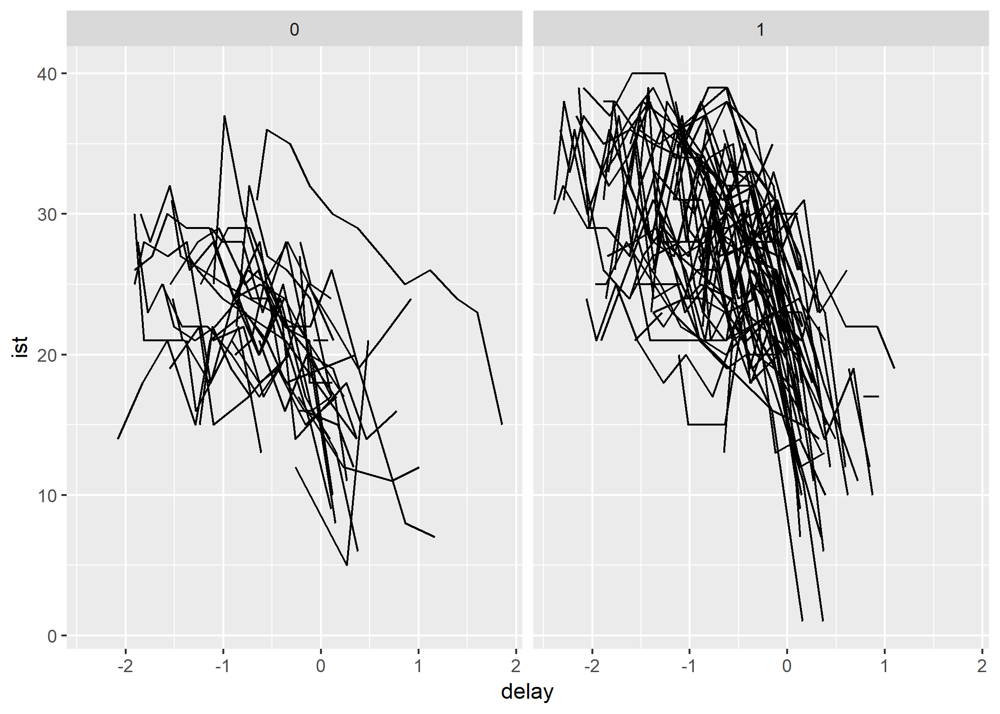
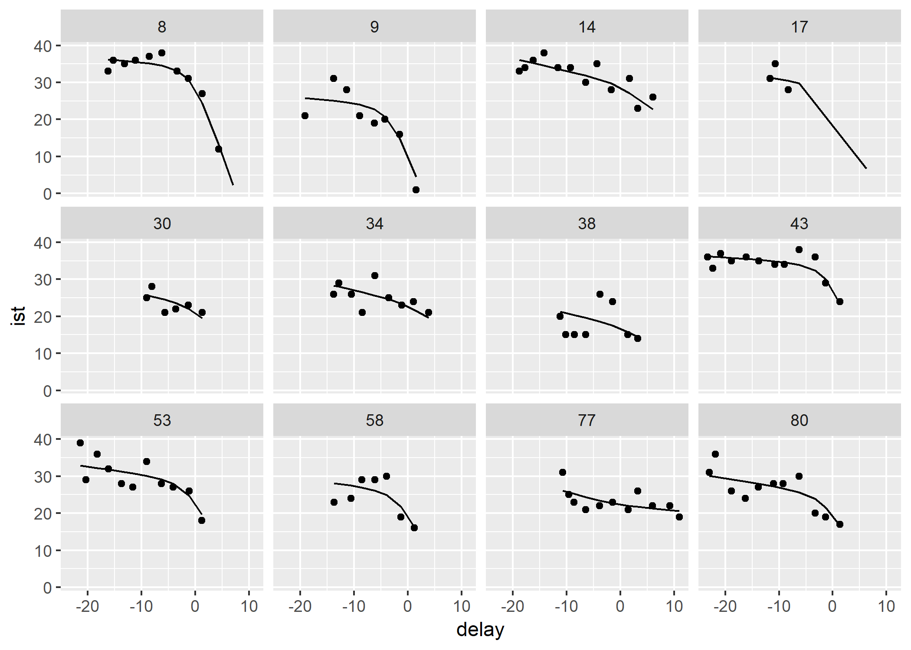

Introduction
------------

This `R` package proposes different functions to make inference on a
random changepoint framework for longitudinal data. The work is still in
progress and the package is not yet fully functional. Already
implemented or being implemented are : \* testRCPMM: a test for the
existence of a random changepoint for longitudinal data \* rcpme: an
estimation algorithm for random changepoint mixed models \* bircpme: an
estimation algorithm for bivariate random changepoint mixed models
taking into account an eventual correlation between two markers

In the following, we will see how to use these functions and how to
manipulate them with a toy dataset.

The dataset: PAQUID cohort
--------------------------

The PAQUID cohort is an epidemiologic study on cogntive ageing launched
in South-West France in 1988. In the `rcpm` package, a sample of one
hundred randomly selected demented subjects has been extracted and
provided as a toy dataset in the package. Let us import the dataset into
the working environment and let us look at the data !

    library(rcpm)
    data(paquid)
    head(paquid)

    ##   id ist      delay el
    ## 1  1  25 -1.9700001  1
    ## 2  1  25 -1.8621301  1
    ## 3  1  28 -1.6521401  1
    ## 4  1  23 -1.1809501  1
    ## 5  1  16 -0.1474333  1
    ## 6  1  15  0.1474333  1

The dataset contains one line per visit. On each line, we can read `id`
the patient identifier , `ist` its current Isaacs Set Test valuewhich
measures memory impairment, `delay` the current delay to patient
diagnostic of dementia divided by ten and `el` a binary variable for
educational level (0 for non primary school certificate patients, 1 for
other).

It is interesting to look at the all longitudinal trajectory according
to educational level

Testing the existence of the random changepoint
-----------------------------------------------

A first step is to assess if there is a random changepoint in these
trajectories for both groups. This will be done with the `rcpm` function
`testRCPMM`. But first let us create two datasets for each educational
level.

    paquid_el0 <- paquid[paquid$el == 0, ]
    paquid_el1 <- paquid[paquid$el == 1, ]

To apply the test, we need to specify a formula indicating the score
variable, the time variable and the grouping variable considered. This
formula must be written this way `score ~ time | group` so that in our
example, it should look like `ist ~ delay | id`. This first two
arguments are essential for the function to run. Next argument is
`covariate` but the underlying functionnality has not been developed yet
so I will not give details about it. The `gamma` argument is used to
smooth the trajectory at the date of the changepoint, it has to be fixed
at a small value regarding the timescale, here `delay`. Be careful, by
default, its value is 0.1 so if your timescale is very reduced, let us
say from 0 to 0.1, you need to chose a smaller value for `gamma`. The
argument `nbnodes` indicates the number of nodes used for the
pseudo-adaptive gaussian quadrature which is used tu numerically compute
the integrals. I would advise not to touch this value. Finally, the
`nbpert` is important because it fixed the size of the empirical null
test statistics which will be used to compute the empirical pvalue.
Default is 500 which might induced quite a long computing time.

    test_el0 <- testRCPMM(longdata = paquid_el0, formu = ist ~ delay | id)
    test_el0

    ## $`empirical p-value`
    ## [1] 0.092
    ## 
    ## $`obs. stat`
    ## [1] -5.513509

    test_el1 <- testRCPMM(longdata = paquid_el1, formu = ist ~ delay | id)
    test_el1

    ## $`empirical p-value`
    ## [1] 0
    ## 
    ## $`obs. stat`
    ## [1] -23.24749

Estimating the random changepoint model
---------------------------------------

Now that we tested for the existence of a random changepoint and did not
rejected its absence for high educational level, we can estimate the
random changepoint model. This is done with the `rcpme` function.

    esti <- rcpme(paquid_el1, ist ~ delay | id, nbnodes = 10, model = "bw", link = "linear")
    esti

    ## $call
    ## $call[[1]]
    ## rcpme
    ## 
    ## $call$longdata
    ## paquid_el1
    ## 
    ## $call$formu
    ## ist ~ delay | id
    ## 
    ## $call$nbnodes
    ## [1] 10
    ## 
    ## $call$model
    ## [1] "bw"
    ## 
    ## $call$link
    ## [1] "linear"
    ## 
    ## 
    ## $Loglik
    ## [1] -1291.964
    ## 
    ## $formula
    ## ist ~ delay | id
    ## 
    ## $fixed
    ##           par se(par)   ICinf  ICsup Wald stat. pvalue
    ## beta0  27.817   0.907  26.040 29.594     30.679      0
    ## beta1 -14.158   2.281 -18.628 -9.688     -6.208      0
    ## beta2 -12.216   2.306 -16.737 -7.696         NA     NA
    ## mutau  -0.122   0.084  -0.287  0.042         NA     NA
    ## 
    ## $sdres
    ## [1] 3.232696
    ## 
    ## $VarEA
    ##           [,1]      [,2]      [,3]       [,4]
    ## [1,]  28.35515 -29.39257 -34.36392 0.00000000
    ## [2,] -29.39257  50.63468  59.61890 0.00000000
    ## [3,] -34.36392  59.61890  70.30699 0.00000000
    ## [4,]   0.00000   0.00000   0.00000 0.01688214
    ## 
    ## $optpar
    ##  [1]  27.8172111 -14.1581333 -12.2161527  -0.1221993   3.2326965
    ##  [6]   5.3249554  -5.5197786  -6.4533720   4.4907376   5.3438246
    ## [11]  -0.3232900  -0.1299313
    ## 
    ## $covariate
    ## [1] "NULL"
    ## 
    ## $REadjust
    ## [1] "no"
    ## 
    ## $invhessian
    ##                [,1]         [,2]         [,3]          [,4]          [,5]
    ##  [1,]  0.8221283864  0.003256801 -0.322263001 -0.0302992253  0.0007620257
    ##  [2,]  0.0032568005  5.201618190  5.136104983 -0.1591676721  0.0338709627
    ##  [3,] -0.3222630014  5.136104983  5.319437089 -0.1443233842  0.0354469470
    ##  [4,] -0.0302992253 -0.159167672 -0.144323384  0.0070579483 -0.0011077503
    ##  [5,]  0.0007620257  0.033870963  0.035446947 -0.0011077503  0.0174172400
    ##  [6,] -0.0503389725 -0.079384693 -0.037034571  0.0028950866 -0.0060285502
    ##  [7,]  0.3835600575  2.355777041  2.152674755 -0.0921726414  0.0224263041
    ##  [8,]  0.4000618250  2.293349515  2.060616694 -0.0887801542  0.0279814187
    ##  [9,] -0.2373158487 -1.449131269 -1.329475971  0.0523857537 -0.0194222738
    ## [10,] -0.2142962986 -1.437028186 -1.326793812  0.0513514716 -0.0142777716
    ## [11,] -0.0325631282 -0.003939966  0.062965561  0.0017983674  0.0748164005
    ## [12,]  0.0028119960  0.011199215  0.009922797 -0.0008555675  0.0002318826
    ##               [,6]        [,7]        [,8]        [,9]       [,10]
    ##  [1,] -0.050338972  0.38356006  0.40006183 -0.23731585 -0.21429630
    ##  [2,] -0.079384693  2.35577704  2.29334952 -1.44913127 -1.43702819
    ##  [3,] -0.037034571  2.15267476  2.06061669 -1.32947597 -1.32679381
    ##  [4,]  0.002895087 -0.09217264 -0.08878015  0.05238575  0.05135147
    ##  [5,] -0.006028550  0.02242630  0.02798142 -0.01942227 -0.01427777
    ##  [6,]  0.485304032 -0.49814411 -0.73220980  0.06348452  0.03471641
    ##  [7,] -0.498144113  2.97514176  3.17448992 -0.42944152 -0.72438996
    ##  [8,] -0.732209800  3.17448992  3.60379824 -0.44737608 -0.71780847
    ##  [9,]  0.063484522 -0.42944152 -0.44737608  1.84574621  1.53164933
    ## [10,]  0.034716409 -0.72438996 -0.71780847  1.53164933  1.55655114
    ## [11,] -0.078875922 -0.80408190 -0.54589031 -0.90384496 -0.08585452
    ## [12,]  0.001585263  0.02100994  0.01887481  0.03190308  0.02096557
    ##              [,11]         [,12]
    ##  [1,] -0.032563128  0.0028119960
    ##  [2,] -0.003939966  0.0111992146
    ##  [3,]  0.062965561  0.0099227969
    ##  [4,]  0.001798367 -0.0008555675
    ##  [5,]  0.074816400  0.0002318826
    ##  [6,] -0.078875922  0.0015852634
    ##  [7,] -0.804081899  0.0210099438
    ##  [8,] -0.545890314  0.0188748082
    ##  [9,] -0.903844956  0.0319030773
    ## [10,] -0.085854519  0.0209655732
    ## [11,]  5.098681491 -0.0275491168
    ## [12,] -0.027549117  0.0023434409
    ## 
    ## $conv
    ## [1] 1
    ## 
    ## $init
    ##  [1] 21.7614447 -6.6189204 -0.5000000 -0.6194516  4.1875530  3.9549840
    ##  [7]  0.0000000  0.0000000  1.0000000  0.0000000  1.0000000  1.0000000
    ## 
    ## $model
    ## [1] "bw"
    ## 
    ## $gamma
    ## [1] 0.1
    ## 
    ## $link
    ## [1] "linear"

To assess the quality of the obtained estimation, we can use the
function `IndPres` that estimates individual prediction based on the
output of the `rcpme` function. We plotted for twelve randomly selected
subjects their individual prediction (plain line) vs. their observed
measures (dots).

    pred <- unlist(IndPred(esti))

